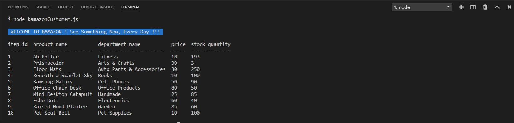

# Bamazon
<h3>Built With</h3>

<ul>
<li>Node.js</li>
<li>MySQL</li>
</ul>

<h3>Overview</h3> 
In this activity, creating an Amazon-like storefront with the MySQL. The app will take in orders from customers and deplete stock from the store's inventory. 

<h3>Customer View Requirement</h3>
<ol>
<li> Create a Node application called bamazonCustomer.js. Running this application will first display all of the items available for sale.</li>
</ol>
<!--  -->

<ol start="2">
<li>The app should then prompt users with two messages.</li>
<ul>
<li>The first should ask them the ID of the product they would like to buy.</li>

<li>The second message should ask how many units of the product they would like to buy.</li>

</ul>
</ol>

<!-- <ul>
<li>The first should ask them the ID of the product they would like to buy.</li>
</ul> -->
<!-- 

<ul>
<li>The second message should ask how many units of the product they would like to buy.</li>
</ul>
 -->

<ol start="3">
<li>Once the customer has placed the order, application should check if store has enough of the product to meet the customer's request.</li>
 <li>If store does have enough of the product, app should fulfill the customer's order.</li>
 <ul>
 <li>This means updating the SQL database to reflect the remaining quantity.</li>
 <li>Once the update goes through, show the customer the total cost of their purchase.</li>
 </ul>
</ol>

